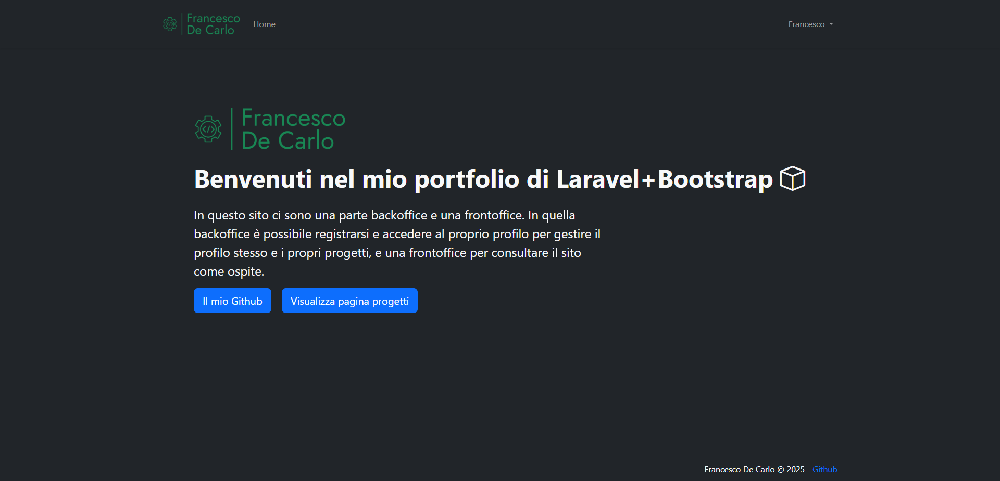

# Il mio portfolio Laravel

In questo sito ci sono una parte backoffice e una frontoffice.

In quella backoffice è possibile registrarsi e accedere al proprio profilo per gestire il profilo stesso e i propri progetti, e una frontoffice per consultare il sito come ospite.

- pagina welcome
